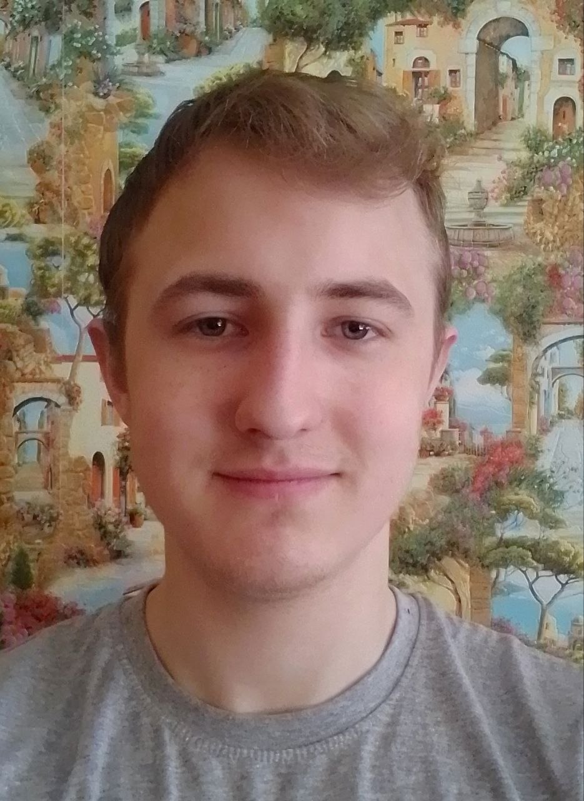

# Skibsky Ivan



## About me

I am learning web development from scratch. I enjoy creating websites and solving problems that make me think. I am persistent, curious, and able to independently figure out complex topics. I understand that the path in IT is not easy, but I am ready to study hard and constantly acquire new skills to grow as a specialist.

## Contact Information

- **Email:** skibsky.ivan@yandex.ru
- **Discord:** @__kisel___93562
- **Telegram:** @skipskiy
- **GitHub:** @Skibsky-Ivan

## Education / Languages

- **BSU** (Belarusian State University) — Faculty of Mechanics and Mathematics, Major: Mathematics
- **Russian:** Native speaker
- **English:** A1 (Beginner)

## Skills

- HTML / CSS
- JavaScript
- Git / GitHub

## Projects

#### [CV. Markdown & Git / HTML, CSS & Git](https://github.com/Skibsky-Ivan/rsschool-cv/tree/rsschool-cv-html)

The first completed educational project within the JS/FE Preschool course.

- **Core:** Developed a structured CV using Markdown syntax / Developed a structured CV using HTML & CSS.
- **Tech Stack:** Git, GitHub, Markdown, HTML, CSS.

## Code Example

**Task:** You are climbing a staircase. It takes n steps to reach the top. Each time you can either climb 1 or 2 steps. In how many distinct ways can you climb to the top?

```javascript
var climbStairs = function(n) {
    if (n < 3) return n;
    
    let prev1 = 1;
    let prev2 = 2;
    
    for (let i = 3; i <= n; ++i) {
        let curr = prev1 + prev2;
        prev1 = prev2;
        prev2 = curr;
    }
    
    return prev2;
};